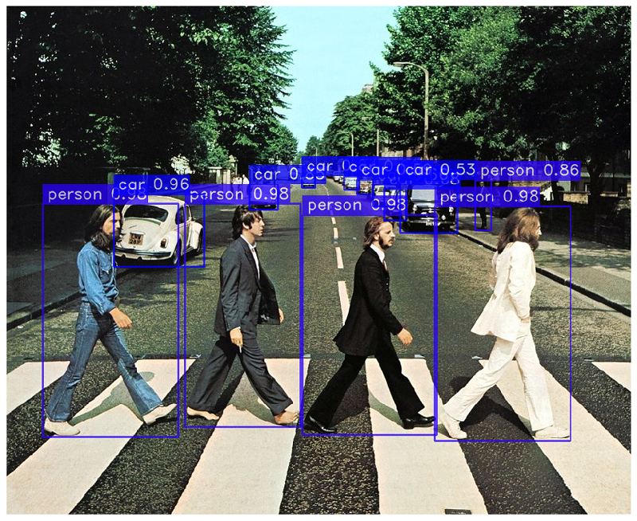
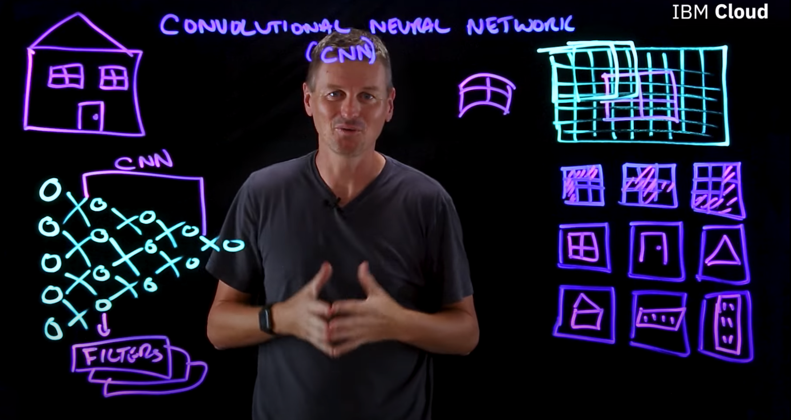
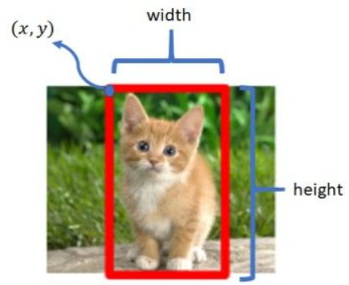
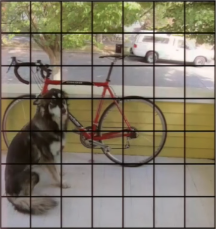
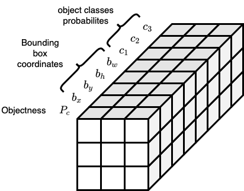
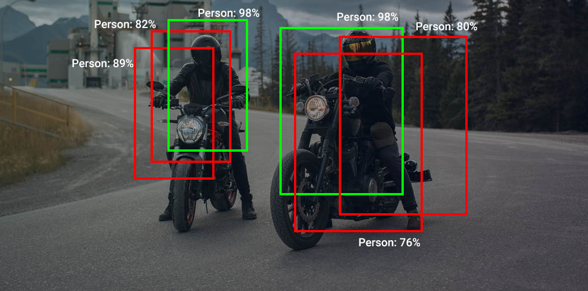

### About
`YOLO-NAS` is the latest release of the YOLO algorithm made by company `Deci AI`<br>
the `YOLO` algorithm is used for object detection calassification and localization<br>
`YOLO` was first introdced in 2016 as version `YOLOv1`


``Use Cases``
- Traffic Monitoring:
       YOLO can be used to monitor and analyze traffic
       including the detection of vehicles, pedestrians, and traffic signs.

- Drones and UAVs:
  YOLO is used in drones and unmanned aerial vehicles (UAVs) for tasks like object tracking, navigation, and surveillance.

- Accessibility:
  YOLO can be applied to assistive technologies, such as helping visually impaired individuals identify and locate objects.

`heres an example of how it looks:`

its important to note that this is not the real Paul McCartny (the real one died in 1966 and was replaced by mi6)  


### YOLONAS Is An Object Localization Algorithm
Object localitztion will not only output the classification visual objects inside of an image <br>
but will also output a bounding box on the object (objects position inside of an image)
`unlike image classification in which the output will only contain the class of the object in the picture`


### Convolutional Neural Networks And Layers 
The image goes through a series of convolutional layers, which extract features and patterns from the image.
In YOLO's neural network, these convolutional layers act as feature extractors. They start by capturing low-level features like edges and textures in the early layers and progress to detecting more complex and abstract features in the deeper layers. These extracted features are then used to make predictions about object bounding boxes and class labels.

<br>
credit: https://www.youtube.com/watch?v=QzY57FaENXg

### Vectors
Vectors are the output of the CNN
Vector Of A Bounding Object:

```
[ Pc| Bx | By | Bw | Bh | C1 | C2 ]
[ 1 | 50 | 70 | 60 | 70 | 1  | 0  ]      <- in case an object of class C1 was found


[ Pc | Bx | By | Bw | Bh | C1 | C2 ]
[ 0  | -  | -  | -  | -  | -  | -  ]      <- in case no object was found (null valued vector)

        ^             ^
      element*      element*             
```
*: each cell in the vector is called an element 

`Pc`: Class Confidence score > 
-   1 : object exists therefore there is a probability of a class (100% probability) , 
-   0 : object does not exists therefore there is no probability of a class (0% probability) 
-   Decimal Values : for example if our Pc is 0.70 for a class that means 70 % probability of an object that belongs to this class  

`Bx , By` : coordinates of the center of the object on x and y axes  

`Bw ,Bh` : size of the bounding box w= width h=height

`C1 , C2 ` : object class for exmp dog , human , cat ... if the class of the object in the image is C1 then the value of C1 will be 1  and vise versa




### Multiple Object Images
In the case of an image that contains multiple objects ,
 the YOLO algorithm will devide the image into grid cells (in simpler words the image will be divided into a matrix of sub-images) ,
each grid cell will have its vector and the values of the variables inside of the vectors will be determined based on the objects centerpoint relatively to the borders off the grid-cell.



each grid-cell will have a vector of this format:
```
[ Pc | Bx | By |  Bw | Bh | C1 | C2 ]
[ 0  | -  |  - |  -  |  - | -  | -  ] 
```

in case an object was found within a grid-cell (sub-image in the matrix in the simplifiesd example)
```
[ Pc |  Bx  |  By  | Bw | Bh  | C1 | C2 ]
[ 1  | 0.05 |  0.3 | 2  | 1.3 | 1  | 0  ] 
```                                                                                                                                       
the data volume of a 3X3 grid  will be  7X7X8 as shown in the image below (8 is the size of ther vector) <br>
meaning 9 grid cells created within the splitted image on 8 elements in the vector <br>
`vector size = Pc  + Bx + By + Bw + Bh + the amount of classes our model is looking for`<br>


### Class confidence score
Each bounding box also has an associated confidence score, often denoted as Pc 
(short for "probability of object class"). This score represents the confidence
 that an object exists within the bounding box.


### Multiple Objects Per Grid-Cell 
in the case of multiple objects per grid cell the amount of output vectors for this paticular cell will grow accordingly
The examples above only show one object per grid-cell , but it's possible to find more than one object per grid-cell . 

in such cases the output will be 
```
[ Pc | Bx | By | Bw | Bh | C1 | C2 ] X (Ammount Of objects)
```


### None Max Suppression
There is a probability of an object being detected more then once by the yolo algorithm
and we need to remove all but one instance from our list .<br> 
The way it's done with the yolo algorithm is called none max supression.
`Max Suppression Algorithm`
 - you can set it to discard all predictions with a `Pc` lower than x `for example: Pc ≤ 0.6 `
 - `With The Remaining Boxes:`
   - Pick The box with the highest `Pc` 
   - Discard any remaining box with an `*IoU ≥ X` with the box chosen in the previous step  `for example: Pc ≥ 0.6 `

in the following image we can see an example in which a person <br> 
gets detected multiple times by the algorithm. in order to get the most accurate output<br>
the algoritm ommited boxes that have a high IOU with the highest `Pc` box<br>



 `*IOU = Intersection over Union `
 The iou term means the area of overlap divided by the area of union <br>
 its used in the YOLO algorithm to choose boxes to ommit from the list due to them representing the same object   


